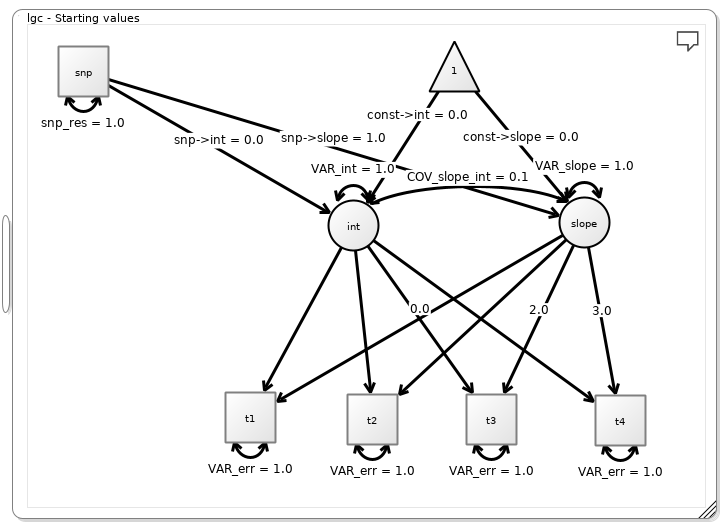
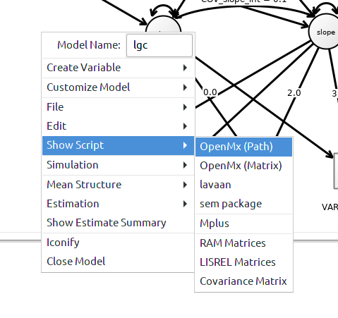

```{r, include = FALSE}
knitr::opts_chunk$set(
  collapse = TRUE,
  comment = "#>"
)
```

Suppose you have longitudinal phenotypic measurements
and genetic data on the same individuals. The **gwsem**
package does not offer a latent growth curve model.
Here we demonstrate how to build a latent growth curve
model from scratch and perform a genome-wide association test
on the slope. Hopefully this demonstration will
inspire researchers to incorporate novel
structural equation models into genome-wide association
studies.

## Design the Model

Visit the [Onyx](http://onyx.brandmaier.de/) website.
Download Onyx, and create the pictured model.



In this model, we have four occasions of measurement
for the phenotype (`t1`, `t2`, `t3`, and `t4`).
There are two latent variables, `int` for the intercept
and `slope` for the slope of the trajectory. The loadings
from `int` to the manifests are all fixed to 1.
In contrast, the loadings from `slope` to the manifests
increase. In OpenMx, it is possible to use the actual date
of measurement instead of time increments of 1 unit.
However, the use of non-unit time increments would
force us to estimate the model using maximum likelihood,
a method much slower than weighted least squares.
So we recommend unit time increments.
The single nucleotide polymorphism (SNP) data will
appear in the `snp` indicator.
It will be convienent to use exactly the name `snp`
because **gwsem** knows which column to use by its name.

We export the model. This model does not entirely
suit our purpose. After copying the code to a file,
we remove the bits relating to `modelData`.
We will also need to make a few changes to
accomodate covariates. To make these changes
easier, we gather up all the `mxPath` statements
into a list.



```{r setup, message=FALSE}
library(gwsem)  # load gwsem
```

```{r}
manifests<-c("t1","t2","t3","t4","snp")
latents<-c("int","slope")
path <- list(mxPath(from="int",to=c("t1","t2","t3","t4"), free=c(FALSE,FALSE,FALSE,FALSE), value=c(1.0,1.0,1.0,1.0) , arrows=1, label=c("int__t1","int__t2","int__t3","int__t4") ),
                 mxPath(from="slope",to=c("t1","t2","t3","t4"), free=c(FALSE,FALSE,FALSE,FALSE), value=c(0.0,1.0,2.0,3.0) , arrows=1, label=c("slope__t1","slope__t2","slope__t3","slope__t4") ),
                 mxPath(from="one",to=c("int","slope"), free=c(TRUE,TRUE), value=c(0.0,0.0) , arrows=1, label=c("const__int","const__slope") ),
                 mxPath(from="snp",to=c("slope","int"), free=c(TRUE,TRUE), value=c(1.0,0.0) , arrows=1, label=c("snp__slope","snp__int") ),
                 mxPath(from="int",to=c("int"), free=c(TRUE), value=c(1.0) , arrows=2, label=c("VAR_int") ),
                 mxPath(from="slope",to=c("slope","int"), free=c(TRUE,TRUE), value=c(1.0,0.1) , arrows=2, label=c("VAR_slope","COV_slope_int") ),
                 mxPath(from="t1",to=c("t1"), free=c(TRUE), value=c(1.0) , arrows=2, label=c("VAR_err") ),
                 mxPath(from="t2",to=c("t2"), free=c(TRUE), value=c(1.0) , arrows=2, label=c("VAR_err") ),
                 mxPath(from="t3",to=c("t3"), free=c(TRUE), value=c(1.0) , arrows=2, label=c("VAR_err") ),
                 mxPath(from="t4",to=c("t4"), free=c(TRUE), value=c(1.0) , arrows=2, label=c("VAR_err") ),
                 mxPath(from="snp",to=c("snp"), free=c(TRUE), value=c(1.0) , arrows=2, label=c("snp_res") ),
                 mxPath(from="one",to=c("t1","t2","t3","t4","snp"), free=F, value=0, arrows=1))
model <- mxModel("lgc", 
                 type="RAM",
                 manifestVars = manifests,
                 latentVars = latents,
                 path)
```

```{r, results='hidden', echo=FALSE}
fam <- read.table(file.path(system.file("extdata", package = "gwsem"), "example.fam"))
N <- nrow(fam)
```

## Simulate Fake Data

Even if we actually had real data, it might be useful
to simulate fake data to develop expertise with our model
and better understand what to expect from the real analyses.
When we built the model in Onyx, we were careful to set starting
values that were also appropriate for data simulation. Due to
this preparation, data are easily simulated.
We simulate `N=``r N` people because this is the amount
of fake SNP data available in the **gwsem**
package (in the `extdata` subdirectory).


```{r}
sim1 <- mxGenerateData(model, N)
head(sim1)
```

A placeholder `snp` column needs to exist in the `sim1` `data.frame`, and will be replaced
with each SNP when we run the GWAS. We add some covariates too.

```{r}
for (ii in 1:5) {
  sim1[[paste0('pc', ii)]] <- rnorm(N)
}
```

## Model Customization

To add covariates, we need to rebuild the model. To make it easy
to rebuild the model,
we saved all the `mxPath` statements in the `path` list (above).
All these paths can be implemented in the new model by
including the `path` list in the model construction.
We add `mxFitFunctionWLS` to select the weighted
least squares fit function and add our simulated data.

```{r}
m2 <- mxModel("lgc", type="RAM",
        manifestVars = model$manifestVars,
        latentVars = c(model$latentVars, paste0('pc', 1:5)),
        path,
        mxExpectationRAM(M="M"),
        mxFitFunctionWLS(allContinuousMethod="marginals"),
        mxData(observed=sim1, type="raw", minVariance=0.1, warnNPDacov=FALSE))
```

At this point, `m2` almost corresponds with the
output of `buildOneItem` or similar model building function.
We just need to set up the covariates.

```{r}
m2 <- setupExogenousCovariates(m2, paste0('pc', 1:5), paste0('t',1:4))
```

The model is ready to run. If we had ordinal indicators
then we could use `setupThresholds` to perform some
additional set up.

## Running the GWAS

We run the model on the first SNP as a sanity check to ensure
that our model is working correctly.
The `GWAS` function writes parameter estimates to the given
`out.log` file, but it also returns the model back to **R**.
We can call `summary` on this model to see the results from
the first SNP.

```{r}
tdir <- tempdir()
dir <- system.file("extdata", package = "gwsem")
snp1 <- GWAS(m2, file.path(dir,"example.pgen"), file.path(tdir, "out.log"), SNP=1)
summary(snp1)
```

This looks alright so we proceed to run all the SNPs
and retrieve the results. The `loadResults` function
calculates Z scores and P values for the `snp__slope`
parameter. We might also examine the `snp__int` parameter.

```{r}
GWAS(m2, file.path(dir,"example.pgen"), file.path(tdir, "out.log"))
got <- loadResults(file.path(tdir, "out.log"), 'snp__slope')
```

Some of the models failed to fit. 

```{r}
head(got[is.na(got$P),])

```

It looks like `r sum(is.na(got$P))` SNPs had a variance below
the threshold we specified in `mxData` (`minVariance=0.1`).
We can exclude these SNPs and present a manhattan plot.

```{r, message=FALSE}
got$P[is.na(got$P)] <- 1

library(qqman)
manhattan(got)
```
